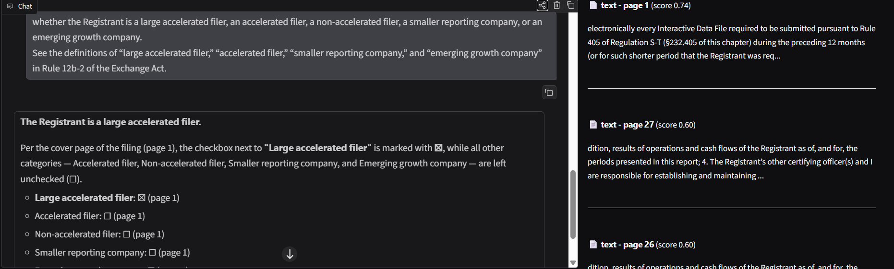

# PDF RAG: text, tables and figures

A Retrieval-Augmented Generation (RAG) system that answers natural-language questions about a PDF and
cites the pages it used. It handles three kinds of content: **text**, **tables** and **figures**.
I used 10 SEC filing documents for development while testing metrics are from the holdout Apple's Q3 2022 Form 10-Q.

- Retrieval is **hybrid** (dense embeddings + BM25) and runs **locally**
- Answers and figure captions come from **free OpenRouter models**.
- The UI is a small **Gradio** app that shows the answer and the retrieved sources.

## Results at a glance

Measured on the reference 10-Q with 46 benchmark questions (top 5 retrieved chunks):

| | Dense-only baseline | Current |
|---|---|---|
| Retrieval hit@5, development (14 q) | 0.71 | **1.00** |
| Retrieval hit@5, held-out (12 q) | n/m | **0.83** |
| Retrieval hit@5, extra (20 q) | n/m | **0.90** |
| Retrieval hit@5, all (46 q) | n/m | **0.91** |
| Live answer accuracy | 8/14 (0.57) | **24/26 (0.92)** |
| Answers citing a page | 0.71 | **1.00** |

n/m = not measured. The development score is optimistic because settings were tuned on it; the held-out
and extra splits are the honest numbers. The two "wrong" live answers were false negatives of a strict
string-match scorer (`$11.0 billion` vs `10,982 million`; "increased" vs "higher"), so true accuracy is
likely higher. Each live figure is a single run of one free-tier model at temperature 1.0, so expect some
variation. Grading on this in an automated way would involve more token usage to prove the accuracy of the model which just not worth it in my opinion.

## Screenshots

**Text question with sources.** Asked whether the registrant is a large accelerated filer. The answer
reads the checkbox marks on the cover page and cites page 1; the right-hand panel lists the retrieved
chunks with page and score.



**Table question.** Asked for gross margin and gross margin percentage for the three- and nine-month
periods. The answer rebuilds the table from the filing's figures, then summarises the changes with a
page citation.


## How it works

```
PDF -> extraction -> chunking -> dense embeddings + BM25 index -> hybrid retrieval -> LLM -> answer + sources
```

| Stage | File | What it does |
|---|---|---|
| Ingest | `pdf_ingest.py` | PyMuPDF extracts page text and embedded images; pdfplumber extracts tables. Each embedded image above 40 px (`MIN_FIGURE_DIM`) is saved to `data/figures/` and described by a vision model, so figures become searchable text. |
| Chunk | `pdf_ingest.py` | Text: 800-character chunks with 120 overlap. Tables: compacted to `Label: v1 \| v2` rows, grouped into ~200-character chunks, each prefixed with up to 300 characters of text above the table (title and column headers) so every chunk stays interpretable and fits the embedder's 256-token window. |
| Index | `vector_store.py`, `bm25.py` | Chunks are embedded locally with `all-MiniLM-L6-v2` (sentence-transformers) into a small NumPy cosine-similarity store persisted to `data/index.npz` + `data/index.meta.json`. A BM25 index sits alongside it. |
| Retrieve | `vector_store.py` | Dense and BM25 each return 50 candidates, fused with Reciprocal Rank Fusion (k=60); the top 5 go to the LLM. BM25 rescues exact figures and rare terms that embeddings blur. |
| Generate | `rag_pipeline.py`, `openrouter_client.py` | A free OpenRouter text model answers using only the retrieved context and cites page numbers. `SYSTEM_PROMPT` lives in `rag_pipeline.py`. |
| UI | `app.py` | Gradio chat with a scrollable panel of the retrieved sources. |
| Config | `config.py` | Paths, model defaults, chunking, retrieval and sampling parameters. |

### Design decisions

- **One unified index** for text, tables and figure captions, so no query classification is needed.
- **Local embeddings** avoid API costs, rate limits and extra dependencies.
- **NumPy vector store** instead of FAISS/Chroma: the corpus is one document, so extra infrastructure
  buys nothing.
- **Captions at ingest time**, so figures cost nothing at query time.
- **Modular files**: the embedder, store or LLM can be swapped without touching the rest.

## Setup

Requires Python 3.10+ (developed on 3.14).

```powershell
python -m venv .venv
.\.venv\Scripts\pip install -r requirements.txt
```

Create a `.env` file in the project root with a free key from https://openrouter.ai/keys:

```
OPENROUTER_API_KEY=sk-or-v1-...

# Optional overrides; the defaults are in config.py
TEXT_MODEL=inclusionai/ling-3.0-flash-fin:free
VISION_MODEL=inclusionai/ling-3.0-flash-vl:free
```

`.env` holds a secret; keep it out of version control.

Free model slugs on OpenRouter change often. If requests start failing with a 404 or model-not-found,
check https://openrouter.ai/models?max_price=0 and update `.env`, or pick another model from the UI
dropdowns (candidates are listed in `config.TEXT_MODEL_CHOICES` / `VISION_MODEL_CHOICES`).

## Run

```powershell
.\.venv\Scripts\python.exe app.py
```

Open http://127.0.0.1:7860. On page load the app indexes the first PDF found in `input/` (skipped if
`data/index.npz` already exists), then you can start asking questions.

- **Change the document:** replace the PDF in `input/` and delete `data/index.npz` and
  `data/index.meta.json` so it is re-indexed on next load.
- **After changing chunking or retrieval code:** delete the saved index too, since it keeps the chunks
  it was built from.
- Python does not hot-reload; restart `app.py` after editing any module.

## Tests

```powershell
pytest                                                          # ~160 tests, offline (embedding model must be cached)
pytest tests/test_rag_quality.py -s                             # prints retrieval metrics
$env:RUN_LIVE_TESTS=1; pytest tests/test_rag_quality.py -k live -s   # live answer accuracy, calls OpenRouter
```

The 46 benchmark questions live in `tests/golden_set.py` and `tests/golden_set_extra.py` (dev, held-out
and extra splits), each with evidence strings copied verbatim from the PDF. The retrieval report is
written to `tests/metrics_report.json`. The live test is opt-in: it needs `OPENROUTER_API_KEY`, and it is
capped at 26 questions because the free tier allows about 50 requests per day (HTTP 429 counts as "not
evaluated", not as a wrong answer).

Tests were written with Claude assistance; Haiku-subagent output was re-verified rather than trusted, and


## Project layout

```
app.py                  Gradio UI
rag_pipeline.py         embedding + retrieval + generation, SYSTEM_PROMPT
pdf_ingest.py           extraction, table conversion, chunking, figure captioning
vector_store.py         NumPy cosine store + hybrid search
bm25.py                 BM25 index and tokenizer
openrouter_client.py    chat_completion / caption_image
config.py               all settings
input/                  the PDF to query
data/                   generated index and extracted figures
docs/                   methodology and approach report
screenshots/            UI screenshots
tests/                  test suite, golden question sets, metrics
```

## Known limitations

- **No OCR.** Scanned PDFs are not supported; the system relies on embedded text.
- **One document at a time.** A single global index; re-indexing overwrites it.
- **hit@1 is only 0.30-0.50.** The right chunk is usually in the top 5 but not first; a cross-encoder
  reranker is the likely next step. Known retrieval misses include `operating_income_q3`,
  `commercial_paper`, `greater_china_sales_q3` and `cost_of_sales_q3_extra`.
- **Reasoning-model token budget.** The default text model "thinks" before answering and can use up
  `TEXT_MAX_TOKENS` (2000), returning empty content. The client raises a clear `OpenRouterError`
  instead of crashing; raise the budget if you switch to another reasoning model. Sampling parameters
  (`temperature=1.0`, `top_p=0.95`, `top_k=20`) are tuned for the default model, not per dropdown choice.
- **Free-tier limits:** about 50 requests per day, and model slugs can be retired without notice.
- **Dense borderless tables** can render as jumbled markdown in the sources panel, though the numbers
  are intact.

## Future work

OCR support; per-document indexes with cross-document retrieval; a cross-encoder reranker or a larger
embedding model with a longer input window (e.g. bge-base); vector-chart detection and captioning; and
FAISS or Chroma if the collection grows.
